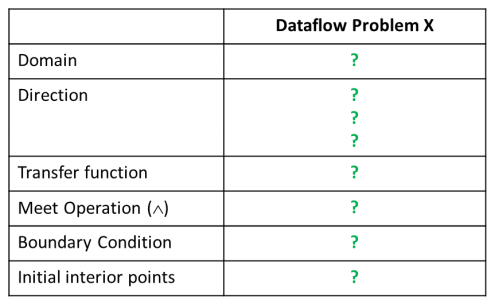
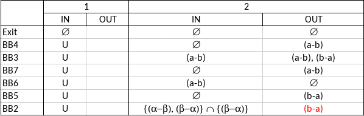

# Second Assignement

In this theoretical assignement we have 3 DataFlow Analysis problems with their respective Control Flow Graphs.
For each, we are required to make a formalization for the DataFlow Analysis Framework and
a table with iterations of the iterative algorithm for solving the problem.

_Formalization Table Example_ \

---

## 1) Very Busy Expressions

-- define very busy --

### Control Flow Graph
The request is to find the _very busy expressions_ at the indicated point\

### Formalization Table
||Very Busy Expressions
---|:---:
Domain| Sets of Expressions
Direction| Backward:   $in[b]=f_b(out[b])$   $out[b]=\land \ in[succ(b)]$
Tranfer Function| $f_b(x)=Def_b \ \cup \ (x-Use_b) $
Meet Operation ($\land$)| $\cap$
Boundary Condition| $in[exit] = \emptyset$
Initial Interior Points| $in[b] = U$

### Iterations Table

**The espression $b-a$ is the _very busy expression_ at the point $P$ in the Control Flow Graph**

---

## 2) Dominator Analysis

-- define dominator --

### Control Flow Graph

### Formalization Table
||Dominator Analysis
---|:---:
Domain| Sets of BasicBlocks
Direction| Forward:   $out[b]=f_b(in[b])$   $in[b]=\land \ out[pred(b)]$
Tranfer Function| $f_b(x)=Gen_b \ \cup \ x $
Meet Operation ($\land$)| $\cap$
Boundary Condition| $out[entry] = \emptyset$
Initial Interior Points| $out[b] = U$
 
### Iterations Table

**From the iterations table we can see that $DOM[F]={A, C, F}$**

---

## 3) Constant Propagation

### Control Flow Graph

### Formalization Table
||Constant Propagation
---|:---:
Domain| Sets of (\<variable>,\<const-value>)
Direction| Forward:   $out[b]=f_b(in[b])$   $in[b]=\land \ out[pred(b)]$
Tranfer Function| 
Meet Operation ($\land$)| $\cap$
Boundary Condition| $out[entry] = \emptyset$
Initial Interior Points| $out[b] = U$

### Iterations Table