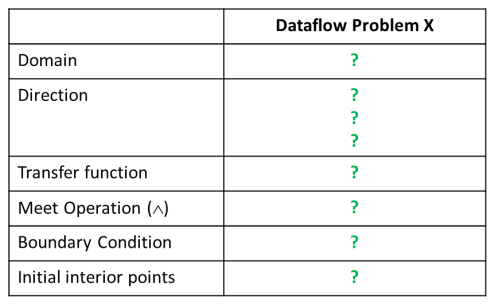
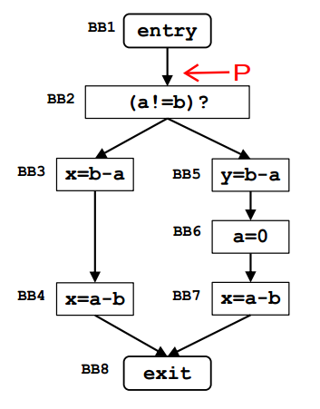
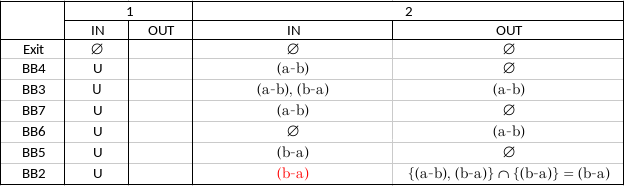
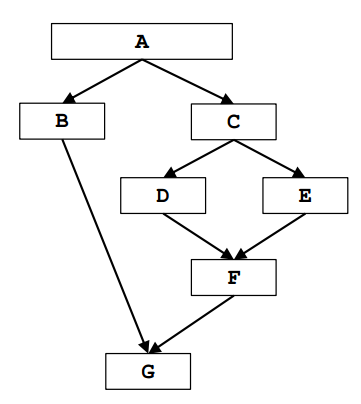
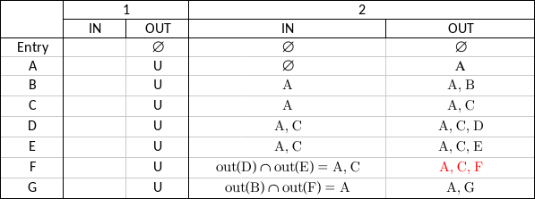
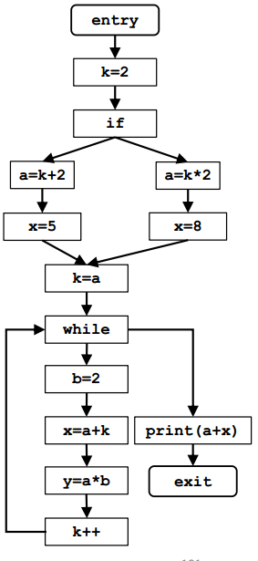
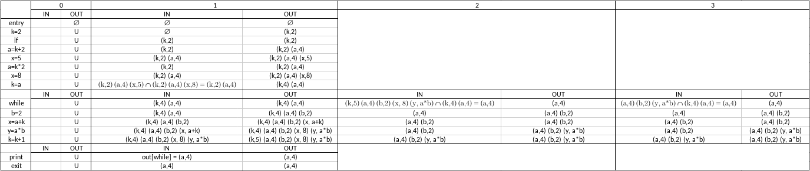

# Second Assignment

In this theoretical assignment we have 3 DataFlow Analysis problems with their respective Control Flow Graphs.
For each, we are required to make a formalization for the DataFlow Analysis Framework and
a table with iterations of the iterative algorithm for solving the problem.

_Formalization Table Example_ \
\

---

## 1) Very Busy Expressions

**Very Busy Expression:** An expression _a+b_ is very busy at a point _p_ if _a+b_ is evaluated in all paths from _p_ to _EXIT_ and there is no definition of _a_ or _b_ along those paths.

### Control Flow Graph
The request is to find the _very busy expressions_ at the indicated point\
\

### Formalization Table
||Very Busy Expressions
---|:---:
Domain| Sets of Expressions
Direction| Backward:   $in[b]=f_b(out[b])$   $out[b]=\land \ in[succ(b)]$
Tranfer Function| $f_b(x)=Gen_b \ \cup \ (x-Kill_b) $
Meet Operation ($\land$)| $\cap$
Boundary Condition| $in[exit] = \emptyset$
Initial Interior Points| $in[b] = U$

### Iterations Table

**The espression $b-a$ is the _very busy expression_ at the point $P$ in the Control Flow Graph**

---

## 2) Dominator Analysis

**Dominator definition:** In a Control Flow Graph we say that a node X dominates another node Y if node X appears in every path of the graph leading from the ENTRY block to block Y.\
By definition, a node dominates itself.

### Control Flow Graph
The request is to find $DOM[F]$ \
\

### Formalization Table
||Dominator Analysis
---|:---:
Domain| Sets of BasicBlocks
Direction| Forward:   $out[b]=f_b(in[b])$   $in[b]=\land \ out[pred(b)]$
Tranfer Function| $f_b(x)=Gen_b \ \cup \ x $
Meet Operation ($\land$)| $\cap$
Boundary Condition| $out[entry] = entry$
Initial Interior Points| $out[b] = U$
 
### Iterations Table

**From the iterations table we can see that $DOM[F]={A, C, F}$**

---

## 3) Constant Propagation

**Constant Propagation:** The goal of Constant Propagation is to determine at which points in the program the variables have a constant value.\
If at node _n_ we have that _x_ has constant value _c_, it means that _x_ is guaranteed to have value _c_ whenever _n_ is reached during the execution of the program.\
**Note:** Constat Propagation analysis also succeeds in determining the constant value of binary expressions in which one or both operands are 
variables whose constant value is known.

### Control Flow Graph

### Formalization Table
||Constant Propagation
---|:---:
Domain| Sets of (\<variable>,\<const-value>)
Direction| Forward:   $out[b]=f_b(in[b])$   $in[b]=\land \ out[pred(b)]$
Tranfer Function| $f_b(x)=Gen_b \ \cup \ (x-Kill_b)$
Meet Operation ($\land$)| $\cap$
Boundary Condition| $out[entry] = \emptyset$
Initial Interior Points| $out[b] = U$

### Iterations Table

The table shows, at each node of the Control Flow Graph, which variables have a constant value and the value itself.

## Contributors
 - Davide Benassi [[@davidebenassi]](https://github.com/davidebenassi)
 - Ivan Giove [[@giove29]](https://github.com/giove29)
